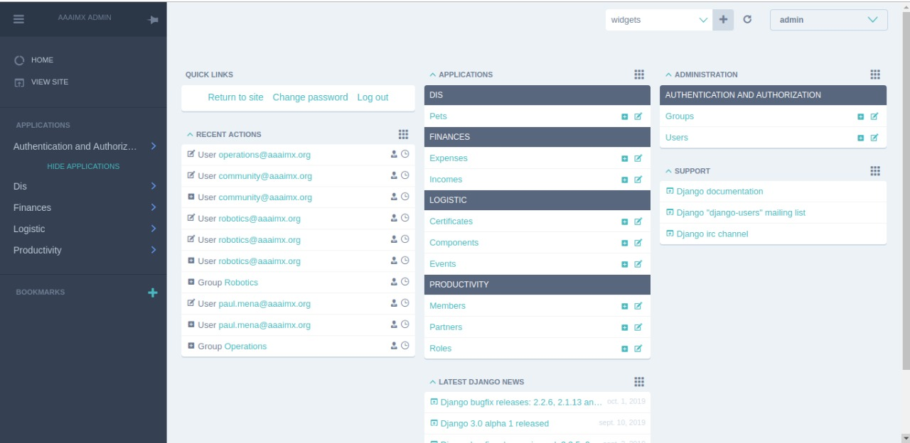

# AAAIMX ADMIN Dashboard built with Django-admin & Django-Jet


# MySQL Client
sudo apt-get install libmysqlclient-dev

# Setup
``` bash
$ virtualenv venv --python=python3
$ source venv/bin/activate
$ pip install -r requirements.txt
```

# Environment

`.env` File
```
export SECRET_KEY='YOUR SECRET KEY'
export DB_NAME='YOUR DATABASE NAME'
export DB_USER='YOUR DB USER'
export DB_PASS='YOUR DB PASSWORD'
export DB_HOST='YOUR DB HOST'
export DJANGO_DEBUG=True
```
> NOTE: Change `DEBUG=True` to `DEBUG=False` in production

# Run project

```bash
$ source .env
$ python manage.py makemigrations
$ python manage.py migrate
$ python manage.py collectstatic
$ python manage.py runserver
```

## Dashboard

